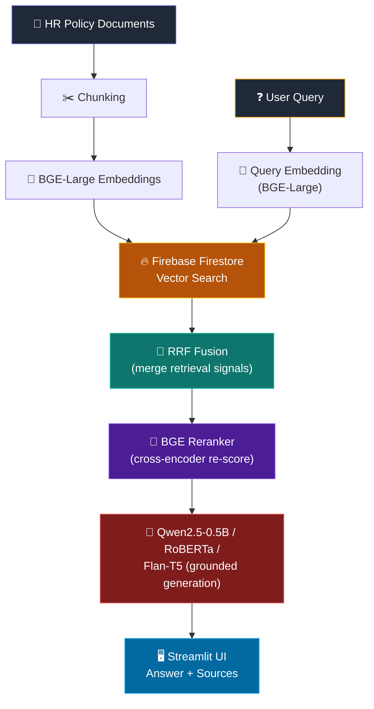

<div align="center">

# ⚡ NOVA_HR

### Hybrid Retrieval-Augmented HR Policy Assistant

**Ask your HR policy documents anything. Get grounded, source-backed answers powered by state-of-the-art hybrid search and a lightweight local LLM.**

[](https://www.python.org/)
[](https://streamlit.io/)
[](https://firebase.google.com/)
[](https://huggingface.co/)
[]()

</div>

---

## 🎯 What Is This?

**NOVA_HR** is a document-grounded HR policy assistant built as a hybrid Retrieval-Augmented Generation (RAG) pipeline. Instead of leaning on a single retrieval method or a heavyweight generative model, it combines:

- **Dense semantic retrieval** with a state-of-the-art English embedding model (**BGE-Large v1.5**)
- **Reciprocal Rank Fusion (RRF)** to merge multiple retrieval signals into one ranked list
- **Cross-encoder reranking** with a **BGE reranker** to sharpen precision on the top candidates
- **Small, efficient local LLMs** (**Qwen2.5-0.5B**, **RoBERTa-base**, **Flan-T5-base**) to generate the final grounded answer

The result is an assistant that answers from your actual HR policy documents — with every answer traceable back to source — while staying lightweight enough to run without a large hosted model.

> 💡 **Why hybrid + rerank + fusion?** Dense retrieval alone can miss exact-term matches; fusing multiple retrieval signals via RRF captures more of the relevant candidates. A reranker then re-scores the fused list with a much stronger (but slower) cross-encoder, so only the final answer generation touches an LLM — keeping hallucination risk low and answers tightly grounded.

---

## ✨ Key Features

| | Feature | Description |
|---|---|---|
| 🔥 | **Firebase Firestore Vector Search** | Native vector search (`find_nearest`, cosine distance) — no separate vector DB infra to manage |
| 🧭 | **BGE-Large Embeddings** | High-quality 1024-dim English dense embeddings from Hugging Face for semantic retrieval (BGE-M3 is a drop-in alternative) |
| 🔀 | **RRF Fusion** | Reciprocal Rank Fusion merges multiple retrieval result sets into a single, more robust ranking |
| 🎯 | **BGE Reranker** | Cross-encoder reranking of fused candidates for precision at the top of the list |
| 🤖 | **Local HF Models** | Qwen2.5-0.5B (causal LM, default), RoBERTa-base (extractive QA), Flan-T5-base (seq2seq) — with cloud HF Router + rule-based fallbacks |
| 📁 | **Dynamic Document Library** | Upload, organize, search, and delete HR policy documents by company directly in the Streamlit UI |

---

## 🏗️ How It Works



**The pipeline, step by step:**
1. **Ingest** — HR policy documents are chunked and embedded with **BGE-Large v1.5**.
2. **Store** — embeddings are written to **Firebase Firestore**, using its native vector search for similarity queries.
3. **Retrieve** — a user query is embedded and matched against Firestore's vector index; multiple retrieval signals are combined via **RRF fusion**.
4. **Rerank** — the fused candidate list is re-scored by a **BGE reranker** cross-encoder to surface the most relevant chunks.
5. **Generate** — the top reranked chunks are passed as context to a local HF model (**Qwen2.5-0.5B** by default, or RoBERTa / Flan-T5), which generates the final answer grounded in that context.
6. **Display** — Streamlit shows the answer alongside the source chunks it was grounded in.

---

## 🧰 Tech Stack

| Layer | Technology | Purpose |
|---|---|---|
| **Frontend / UI** | Streamlit | Document upload, query input, answer + source display |
| **Vector Store** | Firebase Firestore | Native vector search (`find_nearest`, cosine distance) |
| **Embeddings** | BGE-Large v1.5 (Hugging Face) | 1024-dim dense embeddings for semantic retrieval (BGE-M3 swappable) |
| **Fusion** | Reciprocal Rank Fusion (RRF) | Merges multiple retrieval rankings into one |
| **Reranking** | BGE Reranker (Hugging Face) | Cross-encoder re-scoring of fused candidates |
| **Generation** | Qwen2.5-0.5B / RoBERTa / Flan-T5 (Hugging Face) | Compact local LLMs for grounded answer generation; cloud HF Router + rule-based fallbacks |
| **Document Loading** | LangChain Community Loaders | PDF / text ingestion pipeline |

---

## 📂 Project Structure

```
nova_hr_/
├── src/                  # Core retrieval, fusion, reranking, and generation logic
├── data/                 # Source HR policy documents, organized by company
├── tests/                # Automated test suite
├── app.py                # Streamlit application entry point
├── ingest_firebase.py    # CLI for bulk-loading documents into Firestore
├── requirements.txt      # Python dependencies
└── pyproject.toml        # Project metadata
```

---

## 🚀 Getting Started

### 1️⃣ Set Up a Virtual Environment

```bash
# Create
python -m venv .venv

# Activate — Windows
.venv\Scripts\activate

# Activate — macOS/Linux
source .venv/bin/activate
```

### 2️⃣ Install Dependencies

```bash
pip install -r requirements.txt
```

### 3️⃣ Configure Firebase

Add your Firebase project credentials (service account key / config) so Firestore vector search can authenticate. See `src/` for where credentials are expected to be loaded.

### 4️⃣ Run the App

```bash
streamlit run app.py
```

Streamlit launches locally — usually at **`http://localhost:8501`**.

---

## ✅ Running Tests

```bash
pytest tests/ -v
```

---

## 🗺️ Roadmap Ideas

- [ ] Configurable RRF weighting between retrieval signals
- [ ] Swap-in support for larger Phi or Llama variants
- [ ] Multi-user document namespaces in Firestore
- [ ] Export grounded answers with citations to PDF

---

<div align="center">

**Hybrid retrieval. Grounded generation. Built for accuracy.** 🎯

</div>