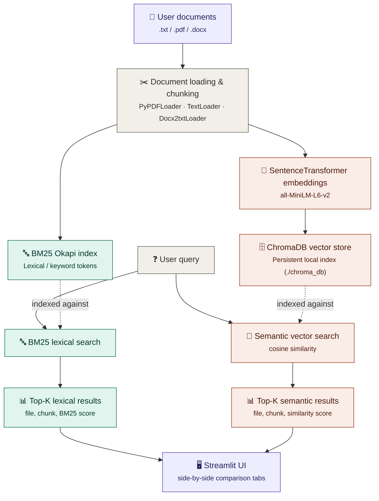

# LOVA_HR ⚡

**Pure Lexical + Semantic Retrieval RAG Engine (Zero-LLM)**

LOVA_HR is a high-performance, deterministic document-based RAG application built using **Streamlit**, **SentenceTransformers (all-MiniLM-L6-v2)**, **ChromaDB**, and **BM25**. 

It uses **zero Large Language Models (LLMs) or generative AI**, relying entirely on precise, verifiable context retrieval from your uploaded documents to guarantee 100% factual accuracy with zero hallucinations.

---

## Key Features

- 🧠 **Zero LLM Dependency** — No external APIs (OpenAI, Anthropic, etc.), no cloud costs, and complete privacy.
- 📁 **Dynamic Document Library** — Upload `.txt`, `.pdf`, and `.docx` files directly through the web UI. Delete files dynamically to prune the knowledge base.
- 🔤 **Lexical Search (BM25)** — High-speed, exact keyword and term matching.
- 🧠 **Semantic Search (Dense Vector)** — Contextual, concept-based similarity search using cosine distance.
- ⚖️ **Comparative Results View** — Displays Lexical and Semantic retrieval results separately in responsive side-by-side tabs for every query, showing files, chunk text, and precise scoring metrics.
- ⚡ **Incremental Vector Indexing** — Chunks and indexes new documents incrementally, skipping already embedded documents to ensure fast performance.

---

## How It Works

```
                        [ User Documents (.txt / .pdf / .docx) ]
                                          │
                                          ▼
                                 [ Text Chunking ]
                                          │
                   ┌──────────────────────┴──────────────────────┐
                   ▼                                             ▼
          [ BM25 Okapi Index ]                      [ Chroma Vector Database ]
           (Lexical Search)                        (Semantic Search via Embeddings)
                   │                                             │
                   └──────────────────────┬──────────────────────┘
                                          ▼
                                   [ User Query ]
                                          │
                   ┌──────────────────────┴──────────────────────┐
                   ▼                                             ▼
        [ Top-K Lexical Results ]                     [ Top-K Semantic Results ]
                   │                                             │
                   └──────────────────────┬──────────────────────┘
                                          ▼
                               [ Streamlit UI Display ]
```

---

## Getting Started

### 1. Set Up Virtual Environment

Create and activate a Python virtual environment:

```bash
# Create
python -m venv .venv

# Activate (Windows)
.venv\Scripts\activate

# Activate (macOS/Linux)
source .venv/bin/activate
```

## How It Works
 
Documents are chunked once, then indexed on **two parallel tracks**: a keyword-based BM25 index for exact term matches, and a dense-vector Chroma index (via `all-MiniLM-L6-v2` embeddings) for conceptual/semantic matches. Every query runs against both, and results are displayed independently so you can compare retrieval strategies directly.
 

 
> Diagram renders automatically on GitHub. If your viewer doesn't support Mermaid, see the plain-text version in [`docs/pipeline.txt`](#) or open this README on GitHub directly.
 

### 2. Install Dependencies

Install the required minimal packages:

```bash
pip install -r requirements.txt
```

### 3. Run the App

Start the Streamlit application:

```bash
streamlit run app.py
```

Streamlit will launch locally, usually at `http://localhost:8501`.

---

## Running Tests

To run the automated test suite verifying file loading, indexing, searches, and incremental deletions:

```bash
pytest tests/ -v
```

---

## Tech Stack

- **Frontend UI**: Streamlit
- **Embeddings**: SentenceTransformers (`all-MiniLM-L6-v2` running locally)
- **Vector DB**: ChromaDB (Persistent local store in `./chroma_db`)
- **Lexical Engine**: Rank-BM25 (`BM25Okapi`)
- **Document Loading**: LangChain Community Loaders (`PyPDFLoader`, `TextLoader`, `Docx2txtLoader`)
