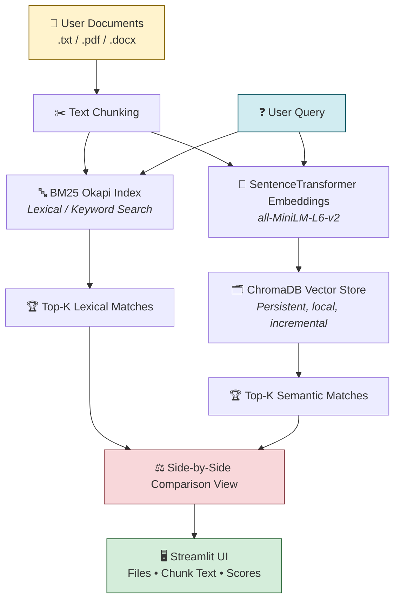
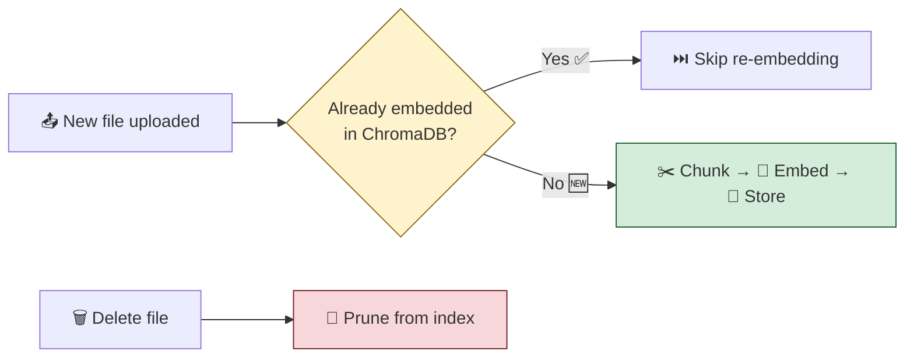
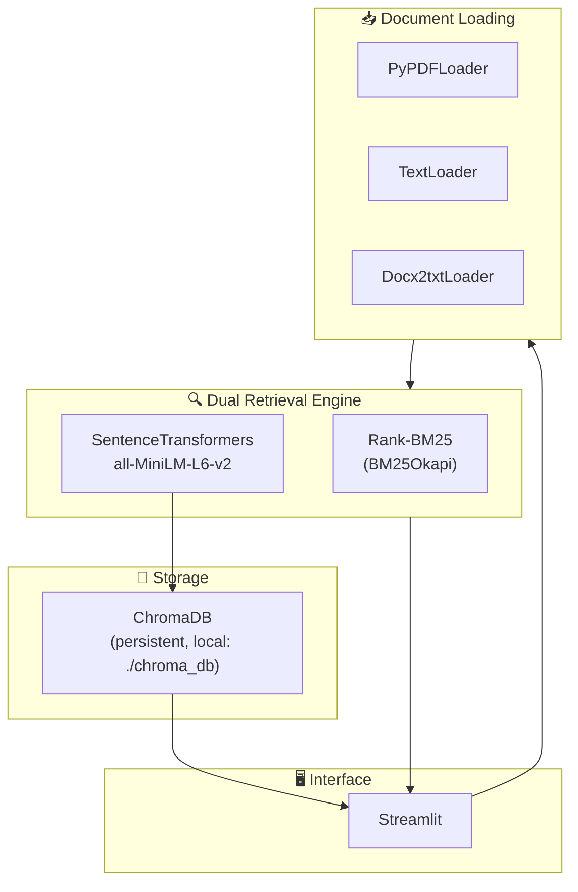

<div align="center">

# ⚡ NOVA_HR

### Pure Lexical + Semantic Retrieval RAG Engine — **Zero LLM**

**Ask questions about your HR policy documents and get exact, verifiable answers — no hallucinations, no API keys, no cloud calls.**


</div>

---

## 🧭 What Is This?

Most HR chatbots wrap an LLM around your documents and hope it doesn't make something up.

**NOVA_HR does the opposite.** It never generates a single word of new text. Instead, it retrieves the *exact* chunk of your uploaded HR policy that answers the question — combining classic keyword search (BM25) with modern semantic embedding search (SentenceTransformers + ChromaDB) — and shows you both, side by side, with real scores. If it's not in the document, it doesn't invent an answer.

| Traditional LLM Chatbot | NOVA_HR |
|---|---|
| 🌀 Can hallucinate facts | ✅ 100% grounded in your documents |
| ☁️ Needs an API key + internet | 🖥️ Fully local, zero external calls |
| 💸 Per-token API cost | 🆓 Free to run, forever |
| 🔒 Sends data to a third party | 🔐 Your HR data never leaves your machine |
| 🤷 Hard to explain *why* it answered | 📊 Shows exact source chunk + score |

---

## 🏗️ The Pipeline — How a Question Becomes an Answer



**In plain words:**

1. 📁 **You upload** HR policy documents (`.txt`, `.pdf`, `.docx`) through the web UI.
2. ✂️ Each document is **split into chunks** small enough to search precisely, large enough to keep context.
3. Every chunk is indexed **two different ways at once**:
   - 🔤 **Lexical** — BM25 builds a keyword-frequency index (great for exact terms: "12 days", "probation period").
   - 🧠 **Semantic** — MiniLM turns each chunk into a vector embedding stored in ChromaDB (great for meaning: "how much time off do I get" ≈ "leave entitlement").
4. ❓ When you ask a question, it's run through **both engines simultaneously**.
5. ⚖️ The **top matches from each side** are displayed in separate tabs — you see exactly which chunk, from which file, with its score, for both approaches.
6. 🚫 No generation step. No LLM. What you see *is* what's in the document.

---

## 🔄 Incremental Indexing — Only New Docs Get Processed



This keeps the app fast as your document library grows — you're never re-embedding the whole knowledge base just to add one new policy PDF.

---

## 🧰 Tech Stack



| Layer | Technology | Purpose |
|---|---|---|
| 🖥️ **Frontend / UI** | Streamlit | Upload docs, ask questions, view results |
| 📥 **Document Loading** | LangChain Community Loaders (`PyPDFLoader`, `TextLoader`, `Docx2txtLoader`) | Parse `.pdf` / `.txt` / `.docx` into text |
| 🧠 **Embeddings** | SentenceTransformers — `all-MiniLM-L6-v2` | Runs **locally**, converts text chunks to dense vectors |
| 🗂️ **Vector Database** | ChromaDB | Persistent local semantic index (`./chroma_db`) |
| 🔤 **Lexical Engine** | Rank-BM25 (`BM25Okapi`) | Classic keyword/term-frequency search |
| 🧪 **Testing** | Pytest | Verifies loading, indexing, search, and deletion |

---

## ✨ Feature Highlights

<table>
<tr>
<td width="50%" valign="top">

### 🧠 Zero LLM Dependency
No OpenAI, no Anthropic, no cloud generative model anywhere in the loop. No API keys, no per-query cost, no risk of the model "creatively" answering a compliance question wrong.

### 📁 Dynamic Document Library
Add or remove `.txt`, `.pdf`, `.docx` files straight from the web UI — the knowledge base updates live, no restart required.

### 🔤 Lexical Search (BM25)
Fast, exact keyword and term matching — ideal for policy numbers, exact phrases, and legal-style precision.

</td>
<td width="50%" valign="top">

### 🧠 Semantic Search (Dense Vectors)
Cosine-similarity search over embeddings — finds the right policy even when the question is phrased completely differently from the source text.

### ⚖️ Side-by-Side Comparison View
Every query shows **both** retrieval methods in responsive tabs — file name, chunk text, and precise similarity/score — so you can see *why* an answer was surfaced.

### ⚡ Incremental Vector Indexing
Already-embedded documents are automatically skipped on re-index, keeping the app fast as the library grows.

</td>
</tr>
</table>

---

## 🚀 Getting Started

```bash
# 1️⃣ Create & activate a virtual environment
python -m venv .venv
source .venv/bin/activate        # macOS/Linux
.venv\Scripts\activate           # Windows

# 2️⃣ Install dependencies
pip install -r requirements.txt

# 3️⃣ Launch the app
streamlit run app.py
```

App opens at **`http://localhost:8501`** 🎉

### 🧪 Run the Test Suite

```bash
pytest tests/ -v
```

Covers file loading, indexing, lexical + semantic search, and incremental deletion.

---

## 📂 Project Structure

```
nova_hr_/
├── app.py              # 🖥️ Streamlit UI entry point
├── main.py             # ⚙️ Core pipeline logic
├── src/                # 🧩 Retrieval + indexing modules
├── data/                # 📄 Uploaded HR documents
├── chroma_db/           # 🗂️ Persistent vector store
├── chroma_test/         # 🧪 Test vector store
├── tests/               # ✅ Pytest suite
├── requirements.txt      # 📦 Dependencies
└── pyproject.toml        # 🔧 Project config
```

---

<div align="center">

### 🔒 Built for accuracy over eloquence.
**If it's not in the document, NOVA_HR won't tell you it is.**

</div>
